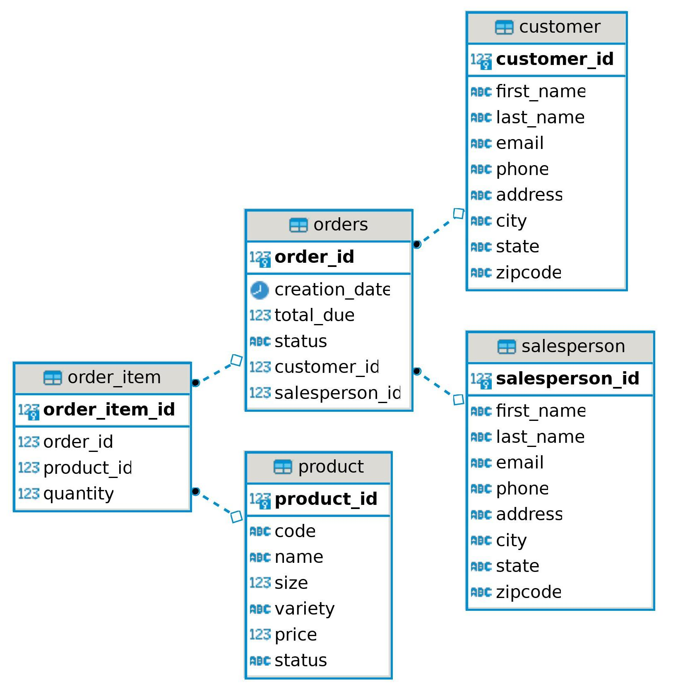

# Introduction
This is a practice project to gain experience and knowledge of the java database connections API  between java and PostgreSQL. A PostgreSQL database HPlusSports is set up to track orders and related information. The connection is made using JDBC implementations of DAO and DTO, which we use to query tables with SQL script and obtain readable data.
# Implementaiton
## ER Diagram

## Design Patterns
#### DAO design pattern
The driver (in this case DatabaseConnectionManager class) creates and handles the connection to the database itself.

DAO is a class that usually has the CRUD operations like INSERT, SELECT, UPDATE, and DELETE. In this project, we have two DAO classes customerDAO and orderDAO which handle CRUD operation of customer info and order info respectively.

DTO is just an object that holds data which either received from the database or has to be inserted into the database. In this project, we have three classes for the creation of DTO:-
Customer:-representing Customer entity.
Order:-representing Order entity.
OrderLine:-representing OrderLine entity.

In nutshell, the driver class creates and maintains the connection between the database and java, and then java creates and accesses a pre-defined DAO method to execute a query. These queries (if they return tables) will return a resultset object, where the DAOs will convert into DTOs. These DTOs can then be accessed and used as common  java objects
### Repository design pattern
The repository pattern separates the business layer from the data access layer. A repository is a collection of objects from a database in our local memory. The business layer will get data from a repository without knowing all the implementation how the data is grabbed or changed. Repository patterns help us in code reusability and are good for a horizontally scalable database. A big downfall of the pattern is atomic transactions are difficult.
# Test
JDBCExecutor class is used in this project to test all the CRUD operations of DAO classes. Special functions are created to test the following operation:-
1. Data is added to the database, ex:- a customer is added to database.
2. Data is read from the database, ex:-customer data is retrieved by id.
3. Updaton is made on required data, ex:- customer email is changed.
4. Unwanted Data is deleted from the database, ex:- customer is deleted by id.

After each operation, a manual test is done by PostgreSQL CLI to check if the operation was completed correctly and there is change in the database.