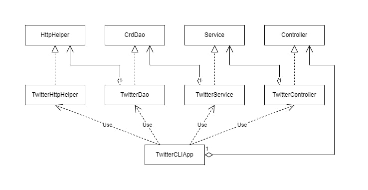

# Introduction

Java application developed around Twitter REST API, which allows users to read, post, and delete tweets using App's CLI. Application is designed with the MVC (minus V) architecture(design pattern) to separate business logic and presentation details. The app runs an HTTP client to create HTTP requests with OAuth 1.0a authentication. Maven was used to build the project and manage all its dependencies. Testing of the app was done by Junit and Mockito and then a Docker image was created so that it can be distributed.</br>

Technologies used in the project: REST API, Java, Spring Framework, DockerJUnit, Mockito, Maven.

  

# Quick Start

-     
    To package the app, use follwing maven command in the terminal:
    
    `mvn clean package`
    
-   Run the twitter app by using Docker:
    
    -   Build docker image:
        
        `docker build -t twitter_app .`
        
    -   To post a tweet, run the following:
        
        ```
           docker run --rm \
           -e consumerKey=YOUR_CONSUMER_KEY \
           -e consumerSecret=YOUR_CONSUMER_SECRET \
           -e accessToken=YOUR_ACCESS_TOKEN \
           -e tokenSecret=YOUR_TOKEN_SECRET \
           twitter_app post "tweet_text" "latitude:longitude"
        
        ```
        
    -   To show a tweet by ID, run the following:
        
        ```
          docker run --rm \
          -e consumerKey=YOUR_VALUE \
          -e consumerSecret=YOUR_VALUE \
          -e accessToken=YOUR_VALUE \
          -e tokenSecret=YOUR_VALUE \
          jrvs/twitter_app show "tweet_id" [field1, field2, ...]
        
        ```
        
    -   To delete tweet(s) by ID, run the following:
        
        ```
          docker run --rm \
          -e consumerKey=YOUR_VALUE \
          -e consumerSecret=YOUR_VALUE \
          -e accessToken=YOUR_VALUE \
          -e tokenSecret=YOUR_VALUE \
          jrvs/twitter_app delete [id1, id2, ...]
        ```
  

# Design

## UML diagram



## Components

### App/Main:
The Twitter app was designed with the MVC architecture, which uses the main() function to call the controller with passed arguments and execute the run() method to run the app.

### Controller:
This layer works with CLI and gets the argument from the user and calls the service layer for the results. This layer also gets the environment variables for OAuth 1.0a authentication from the system.

### Service:

The service layer controls the business logic of the application i.e check if the tweet does not exceed 140 characters and coordinates are correct. Then it calls the DAO layer to access the underlying Twitter REST API and get results.

### Data Access Object (DAO):

The DAO layer gets the information from the services layer and then performs the required operation with help of REST API. This layer interacts with the model of Tweet and then post, read or deletes the tweet using the HTTP client

## Models

Models are implemented with POJOs and proper conversions are made between the object and JSON
-   Tweet Object:
    
    ```
      {
         "created_at":"Mon Feb 18 21:24:39 +0000 2019",
         "id":1097607853932564480,
         "id_str":"1097607853932564480",
         "text":"test with loc223",
         "entities":{
            "hashtags":[],      
            "user_mentions":[]  
         },
         "coordinates":null,   
         "retweet_count":0,
         "favorite_count":0,
         "favorited":false,
         "retweeted":false
      }
    
    ```
    
-   Entity Object:
    
    ```
      "hashtags":[],      
      "user_mentions":[] 
  
    ```
   -   Coordinates Object:
    
        ``` 
        "coordinates":[1,1] 
        ```
   
    

## Spring

Spring framework is used to implement the Inversion of Control (IoC) principle which is a process that has objects define their dependencies through constructor arguments so that it replaces the traditional Dependency management. The IoC container can then inject those dependencies when the bean is created. Bean is a component created/managed by an IoC container, they can be objects or classes. In this app, the Twitter classes are beans.

  

# Test

- Integration Testing:
   Integration testing is done using JUnit 4 by setting up the Twitter classes
using @Before annotation to set up environment variables and call required classes. The result-set( Twitter object ) is then checked with the asserts statement.
 
- Unit testing:
   Unit testing is done with help of Mockito without actually testing the dependencies. Mockito creates mock objects of the dependency classes and passes them to the classes that depend on them. Mockito also controls what the mock object will return when they are called and then the mock objects are checked with assert statements.


  

## Deployment

App is first packed in JAR file using Maven and then Docker file is created to build a Docker image and that image is pushed into Docker Hub. We can download and image and build it on our system and then run the app. For information about running the app [click here](#quick-start).

  

# Improvements
- Create a User-friendly GUI interface where authentication can be done with email/username and password instead of token and keys
- Add more Twitter features ( e.g, retweet, like, comment, etc).

